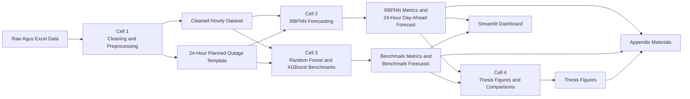

# Thesis Code Block Diagram

Title: AI-Based Short-Term Generation Forecasting of Cascaded Hydroelectric Power Plants

This block diagram shows the complete code workflow from raw data input to cleaned data, model training, benchmark comparison, day-ahead forecasting, dashboard use, and thesis appendix outputs.

```mermaid
flowchart TD
    A[Raw Agus Cascade Excel Data<br/>DATA(JAN2024-JUNE2025).xlsx] --> B[Cell 1: Data Cleaning and Preprocessing<br/>scripts/cell1_clean_data.py]

    B --> B1[Flatten 3-row Excel header]
    B --> B2[Standardize plant, unit, generation,<br/>outage, gate, elevation, rainfall,<br/>and outflow column names]
    B --> B3[Convert date and time<br/>to hourly datetime]
    B --> B4[Clean generation values<br/>near-zero threshold, interpolation,<br/>spike smoothing, KNN imputation]
    B --> B5[Recalculate plant total generation<br/>from unit-level generation]
    B --> B6[Convert outage columns<br/>to binary unit status]

    B1 --> C[Cleaned Hourly Dataset]
    B2 --> C
    B3 --> C
    B4 --> C
    B5 --> C
    B6 --> C

    C --> C1[outputs/cleaned_data/<br/>cleaned_hourly_data.xlsx]
    C --> C2[outputs/cleaned_data/<br/>cleaned_hourly_data.parquet]
    C --> C3[outputs/cleaned_data/<br/>cell1_metadata.json]
    B --> C4[Planned Outage Template<br/>outputs/outages_planning/<br/>Planned_Outages_Input.xlsx]

    C2 --> D[Cell 2: RBFNN Forecasting Model<br/>scripts/cell2_rbfnn.py]
    C4 --> D

    D --> D1[Feature Engineering<br/>temporal, lag, rolling,<br/>unit status, hydrology,<br/>upstream cascade features]
    D1 --> D2[Train or Load Plant-Specific RBFNN Models]
    D2 --> D3[RBFNN Architecture<br/>input layer, RBF layer,<br/>trainable centers and gamma,<br/>linear output layer]
    D3 --> D4[Residual/Delta Forecasting<br/>predict next-hour generation change]
    D4 --> D5[Validation-Based Calibration<br/>shrinkage, bias correction,<br/>selected bin/hourly correction]
    D5 --> D6[Recursive 24-Hour Forecast<br/>outage-aware and capacity-limited]

    D2 --> D7[models/rbfnn/<br/>model files, scalers,<br/>meta_agus*.json]
    D5 --> D8[metadata/overall_metrics/<br/>rbfnn_validation_testing_metrics.xlsx]
    D6 --> D9[outputs/rbfnn_forecast/<br/>Day_Ahead_24H_RBFNN_Forecast.xlsx/csv]

    C2 --> E[Cell 3: Benchmark Models<br/>scripts/cell3_benchmark.py]
    C4 --> E

    E --> E1[Benchmark Feature Engineering]
    E1 --> E2[Random Forest Model]
    E1 --> E3[XGBoost Model]
    E2 --> E4[Benchmark Validation and Testing Metrics]
    E3 --> E4
    E2 --> E5[Recursive 24-Hour Random Forest Forecast]
    E3 --> E6[Recursive 24-Hour XGBoost Forecast]

    E2 --> E7[models/random_forest/<br/>random_forest_agus*.pkl]
    E3 --> E8[models/xgboost/<br/>xgboost_agus*.pkl]
    E4 --> E9[metadata/overall_metrics/<br/>RF and XGBoost metrics/predictions]
    E5 --> E10[benchmark/random_forest/<br/>Day_Ahead_24H_RANDOM_FOREST.xlsx/csv]
    E6 --> E11[benchmark/xgboost/<br/>Day_Ahead_24H_XGBOOST.xlsx/csv]

    D8 --> F[Cell 4: Thesis Metrics and Figures<br/>scripts/cell4_generate_thesis_and_metrics.py]
    D9 --> F
    E9 --> F
    E10 --> F
    E11 --> F

    F --> F1[Testing Actual vs Forecast Plots]
    F --> F2[Residual and Scatter Diagnostics]
    F --> F3[Benchmark Comparison Charts]
    F --> F4[Cleaned Profile Figures]
    F --> F5[Day-Ahead Forecast Figures]

    F1 --> G[thesis_figures/]
    F2 --> G
    F3 --> G
    F4 --> G
    F5 --> G

    D9 --> H[Streamlit Dashboard<br/>streamlit_app.py]
    E10 --> H
    E11 --> H
    C4 --> H
    G --> H

    H --> H1[Dashboard Pages<br/>overview, data management,<br/>planned outage planning,<br/>forecasting, system operation]

    C1 --> I[Paper Context and Appendix Materials<br/>PAPER CONTEXT/generate_appendix_materials.py]
    C2 --> I
    C3 --> I
    C4 --> I
    D7 --> I
    D8 --> I
    D9 --> I
    E9 --> I
    G --> I

    I --> I1[Appendix Tables<br/>Appendix A to I]
    I --> I2[Model Hyperparameter Tables<br/>RBFNN, Random Forest, XGBoost]
    I --> I3[Picture Catalog and<br/>One Excel Table per PNG]
    I --> I4[Screenshot-Style Table Images]
    I --> I5[LaTeX Appendix Files]
    I --> I6[appendix_summary.xlsx]

    I1 --> J[Thesis Appendix Support Files]
    I2 --> J
    I3 --> J
    I4 --> J
    I5 --> J
    I6 --> J
```

## Simplified Defense Version



## Short Explanation

The system starts with the raw Agus cascade Excel dataset. Cell 1 cleans the data, standardizes the columns, handles missing and abnormal values, recalculates plant totals, and creates the 24-hour planned outage template. Cell 2 uses the cleaned data and outage template to train or load the RBFNN models and generate the main 24-hour day-ahead forecast. Cell 3 trains or loads Random Forest and XGBoost benchmark models and generates comparison forecasts. Cell 4 organizes the metrics and figures for thesis presentation. The Streamlit dashboard reads the cleaned data, forecast outputs, and figures for user interaction. The `PAPER CONTEXT` generator creates appendix-ready tables, figures, screenshots, LaTeX files, and summary workbooks for the thesis appendix.
